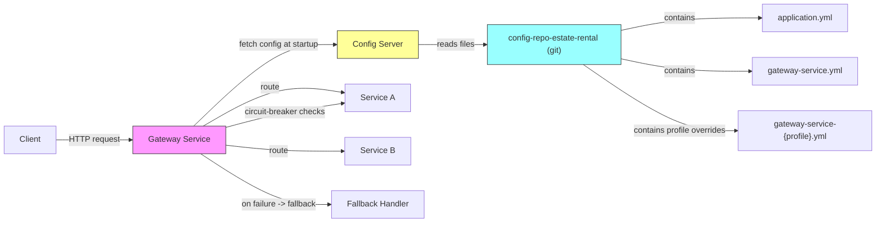

# Gateway Service — Report

## Overview

This microservice acts as the API Gateway for the RealEstate Rental microservices ecosystem. Its primary responsibilities are centralized routing (reverse proxy), externalized configuration consumption (as a client of a Spring Cloud Config Server backed by the project's config repository), resiliency via circuit breakers and fallbacks, and centralized cross-cutting concerns such as security and request filtering.

## Responsibilities (detailed)

## Architecture diagram and config retrieval

The diagram below shows the typical flow: client requests arrive at the Gateway, which routes to downstream services and consults circuit-breakers and fallback handlers when necessary. The Gateway obtains its runtime configuration from a Spring Cloud Config Server, which reads configuration files from the central config repository.

Configuration retrieval and precedence

- At startup the Gateway (Spring Cloud Config Client) requests configuration from the Config Server. The Config Server serves files from the git `config-repo-estate-rental`.
- Typical file precedence (higher overrides lower):
	1. `application.yml` — global defaults for all applications
	2. `gateway-service.yml` — service-specific defaults for the gateway
	3. `gateway-service-{profile}.yml` (for example `gateway-service-prod.yml` or `gateway-service-dev.yml`) — profile-specific overrides

- Spring Cloud Config resolution follows the pattern `/application/{profile}` and `/{application}/{profile}` — the client will receive merged properties according to the active `spring.profiles.active` value and the application name. The gateway can also be refreshed at runtime if actuator `refresh`/`spring-cloud` refresh endpoints are enabled.

- Code and repo pointers

- Config repo (contains `application.yml`, `gateway-service.yml`, `gateway-service-prod.yml`, etc.): https://github.com/RealEstate-Rental-Project/config-repo-estate-rental
- The gateway's config client settings are typically in `bootstrap.yml` or `application.yml` (see [src/main/resources/application.yml](src/main/resources/application.yml)).

	The gateway acts as a client of a Spring Cloud Config Server (hosted within the RealEstate-Rental-Project organization). At startup the gateway fetches its properties (routes, timeouts, circuit-breaker settings, credentials, etc.) from the config server, enabling centralized management and dynamic updates without rebuilding the service. Typical config properties include `spring.cloud.config.uri`, route definitions, and circuit-breaker policies.

- **Circuit Breaker & Fallbacks:** To improve resilience, the gateway applies circuit breakers on outgoing calls to downstream services. When a target service is slow or failing, the circuit breaker trips and requests are routed to a fallback handler instead of waiting for failing downstream calls. This prevents cascading failures and allows graceful degradation of functionality.

	- The repository includes a fallback handler and router configuration that implement fallback behavior for failing routes. See the code pointers below.

- **Fallback Handler:** When a circuit breaker trips, the gateway routes to a local fallback endpoint that returns a meaningful fallback response (status + body) instead of propagating downstream errors. This keeps clients responsive and provides consistent error handling.

- **Security & Cross-cutting Concerns:** The gateway enforces authentication/authorization, request header propagation, and other policies before forwarding requests. Centralizing security at the gateway reduces duplication across downstream services.

- **Observability & Metrics:** The gateway is a convenient place to collect metrics, logs and traces for incoming requests and for outgoing calls to services. Circuit-breaker events, latency metrics, and error rates are valuable for alerting and capacity planning.

## How configuration is managed

- Centralized configuration is stored in the config repo above. The gateway is configured as a Spring Cloud Config Client and obtains its configuration at startup from the Config Server. Typical configuration items stored in the repo include:
	- Route definitions (path predicates, target URIs, filters)
	- Circuit breaker timeouts, thresholds, and fallback URIs
	- Security properties (JWT keys, OAuth details, CORS, allowed origins)
	- Environment-specific overrides (profiles for `dev`, `staging`, `prod`)

- Important runtime environment variables / properties:
	- `SPRING_CLOUD_CONFIG_URI` or `spring.cloud.config.uri` — URL of the config server
	- `spring.profiles.active` — active profile to select correct config

## Code pointers

- Router / fallback configuration: [src/main/java/ma/fstt/gatewayservice/config/FallbackRouterConfig.java](src/main/java/ma/fstt/gatewayservice/config/FallbackRouterConfig.java)
- Fallback handler implementation: [src/main/java/ma/fstt/gatewayservice/handler/GatewayFallbackHandler.java](src/main/java/ma/fstt/gatewayservice/handler/GatewayFallbackHandler.java)
- Security configuration: [src/main/java/ma/fstt/gatewayservice/config/SecurityConfig.java](src/main/java/ma/fstt/gatewayservice/config/SecurityConfig.java)
- Local config example: [src/main/resources/application.yml](src/main/resources/application.yml)

These files show how routes, fallback URIs and security are wired in the gateway. The fallback handler provides the content returned to clients when a downstream call fails or when a circuit has opened.

## Deployment notes and prerequisites

- Ensure the Spring Cloud Config Server is reachable by the gateway at startup and that the desired configuration branch for the environment exists in the `config-repo-estate-rental` repository.
- If using a circuit-breaker implementation such as Resilience4j or Spring Cloud Circuit Breaker, make sure the circuit-breaker dependency and configuration are present in `pom.xml` and in the config repository (timeouts, sliding-window sizes, minimum calls, etc.).
- Provide secure means for the gateway to access the config server if the config repo is private (authentication tokens or SSH keys), and ensure sensitive config values are stored securely (vault or encrypted properties) rather than in plaintext in the repo.

## References

- Configuration repository (git): https://github.com/RealEstate-Rental-Project/config-repo-estate-rental
- Organization repositories list: https://github.com/orgs/RealEstate-Rental-Project/repositories

---
